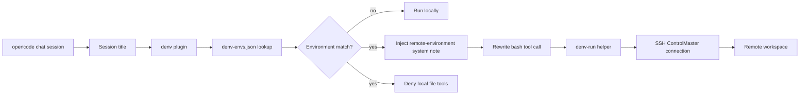

# opencode-denv

[](https://github.com/PKwhiting/opencode-denv/actions/workflows/ci.yml)
[](tsconfig.json)
[](LICENSE)

`opencode-denv` pins individual opencode chat sessions to different remote
development environments. A session chooses its environment from its title, and
the plugin rewrites shell commands so they execute on the matching host over
SSH.

This lets one opencode instance manage multiple isolated remote workspaces
without swapping terminals, changing global config, or asking the model to
remember which machine it is using.

## What it demonstrates

- opencode plugin hooks for tool-call interception and system prompt injection.
- Per-session routing using opencode session metadata.
- Safe SSH command forwarding with stable quoting and reused ControlMaster
  connections.
- Agent guardrails that prevent accidental nested SSH and local file access in
  remote-bound sessions.
- A small launcher alternative for fully locked one-environment sessions.

## How plugin mode works

Plugin mode is the recommended path.

1. `tool.execute.before` receives each tool call and the current `sessionID`.
2. The plugin reads the session title and finds the longest matching environment
   name from `denv-envs.json`.
3. Matching sessions have `bash` commands rewritten to:

   ```bash
   denv-run <env> '<command>'
   ```

4. `denv-run` performs the SSH call, base64-wraps the command to preserve
   quoting, and starts in the configured remote workspace.
5. File tools such as `read`, `edit`, `grep`, and `glob` are denied in bound
   sessions because opencode cannot redirect those tools to the remote host.
   The agent uses shell commands for remote file inspection and edits instead.
6. A system note is injected for bound sessions so the model understands that it
   is already operating inside the selected remote environment.

Sessions whose title does not match a configured environment continue to run
locally unless `DENV_STRICT=1` is set.

## Architecture



## Install plugin mode

Prerequisites:

- opencode installed locally.
- `jq` available locally.
- Key-based SSH access to each remote host.
- `@opencode-ai/plugin` available where opencode loads plugins. For local
  development, run `npm install` in this repository.

Clone the repository:

```bash
git clone https://github.com/PKwhiting/opencode-denv.git
cd opencode-denv
```

Create an environment map:

```bash
mkdir -p ~/.config/opencode
cp denv-envs.example.json ~/.config/opencode/denv-envs.json
```

Edit `~/.config/opencode/denv-envs.json`:

```json
{
  "dev1": { "host": "user@203.0.113.10", "workspace": "/workspace/app" },
  "dev2": { "host": "user@203.0.113.20", "workspace": "/workspace/app" }
}
```

Link the plugin and helper into opencode's global config directory:

```bash
mkdir -p ~/.config/opencode/plugins
ln -sf "$PWD/plugin/denv.ts" ~/.config/opencode/plugins/denv.ts
ln -sf "$PWD/denv-run" ~/.config/opencode/denv-run
```

Restart opencode after linking the plugin or changing `denv-envs.json`.

## Use plugin mode

1. Start opencode normally.
2. Create or rename a chat session so the title contains an environment name,
   such as `dev1`.
3. Ask the agent to run `hostname` or `pwd`.
4. Confirm the command runs on the remote host and starts in the configured
   workspace.

To keep unmatched sessions from running locally, start opencode with:

```bash
DENV_STRICT=1 opencode
```

## Demo flow

With this environment map:

```json
{
  "dev1": { "host": "user@203.0.113.10", "workspace": "/workspace/app" },
  "dev2": { "host": "user@203.0.113.20", "workspace": "/workspace/app" }
}
```

Two opencode sessions can run side by side:

| Session title | Agent command | Routed command | Result |
| --- | --- | --- | --- |
| `dev1 backend fix` | `hostname` | `denv-run dev1 'hostname'` | Runs on `dev1` |
| `dev2 migration check` | `pwd` | `denv-run dev2 'pwd'` | Starts in `/workspace/app` on `dev2` |

The model submits plain shell commands. The plugin performs the wrapping after
the tool call is created, so the agent does not need to remember SSH details.

## Launcher mode

The repository also includes an older launcher flow for one fully locked
opencode instance per environment. Plugin mode is usually more convenient, but
launcher mode is useful when every shell invocation must be routed through a
custom shell wrapper.

Create launcher config:

```bash
cp envs.conf.example envs.conf
```

Edit `envs.conf`, then run:

```bash
./denv ls
./denv dev1
```

Stop a reused SSH control connection with:

```bash
./denv stop dev1
```

## Development

Install dependencies and run validation:

```bash
npm install
npm test
npm run typecheck
npm run shellcheck
```

`shellcheck` must be installed separately for local shell validation. The CI
workflow installs it on Ubuntu.

## Configuration files

| File | Purpose | Commit real values? |
| --- | --- | --- |
| `denv-envs.example.json` | Example plugin-mode environment map | Yes |
| `~/.config/opencode/denv-envs.json` | Real plugin-mode environment map | No |
| `envs.conf.example` | Example launcher-mode environment map | Yes |
| `envs.conf` | Real launcher-mode environment map | No |

## Known limitations

- File reads and edits in bound plugin sessions go through remote shell commands
  such as `cat`, `sed`, and heredocs.
- Each tool call starts a fresh remote shell in the configured workspace. Chain
  dependent commands if a `cd`, virtualenv activation, or exported variable must
  apply to multiple operations.
- Interactive TTY commands are not supported by the per-command SSH forwarding
  path.
- opencode loads plugins and config at startup, so restart opencode after
  changing plugin files, helper scripts, or environment maps.

## Security notes

This tool intentionally forwards model-produced shell commands to remote hosts.
Use it only with development environments that are safe for agent-driven work.
Keep real hosts, usernames, and workspace paths out of committed config files;
see [SECURITY.md](SECURITY.md) for details.
